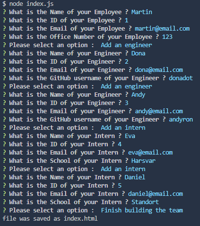

# Team-Profile-Generator-CristianB


Team Profile Generator - part of Bootcamp challenge


## Description

This Project was created for bootcamp challenge.

It tests the knowledge gained in NodeJS, NPMs, Jest, Constructors and Classes,  JavaScript and JQuery during the last weeks, especially the implementation of NodeJS with constructors and classes. It is a Node.js command-line application that takes the user input about employees on a software engineering team, then generate an HTML webpage that displays summaries for each person (index.html). The code can be tested with Jest.

This is how it looks in the terminal:
  

This is how the generated document looks :


## Installation

The repository is on the GitHub repositories public domain https://github.com/docbogdanc/Team-Profile-Generator-CristianB.git.
The repository can be cloned on local disk and then the program can be started by typing ```node index.js``` in the terminal


## Usage

The code is free to be used according to the licence condition (please see the licence file from the GitHub repository)


## Credits


- Bootcamp EDX ( a big cheers for bootcamp teachers! ) provided the needed **materials**, the most wanted **inspiration** and the difficult to obtain **motivation**  

  
- JQuery

        https://cdnjs.com/libraries/jquery/3.2.1


- Node.js v20.11.1.

         https://nodejs.org/en/download/

- Inquirer.js NPM v8.2.4

         https://www.npmjs.com/package/inquirer/v/8.2.4#documentation
        

- Jest NPM 

        https://www.npmjs.com/package/jest  


- Xpert Learning Assistant - the Bootcamp Course AI, used for helping with some of the javascript syntax
 
         https://bootcampspot.instructure.com/courses


- Markdown Guide used for styling the readme.md

         https://www.markdownguide.org/basic-syntax/


## License

MIT license


